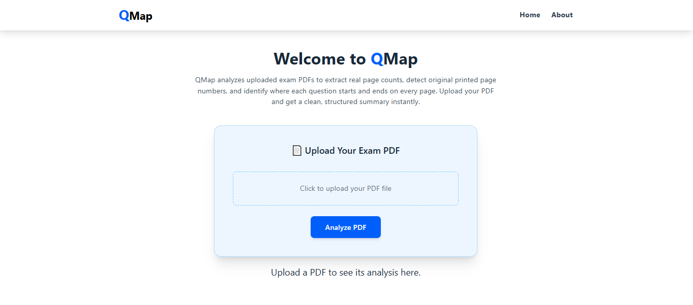
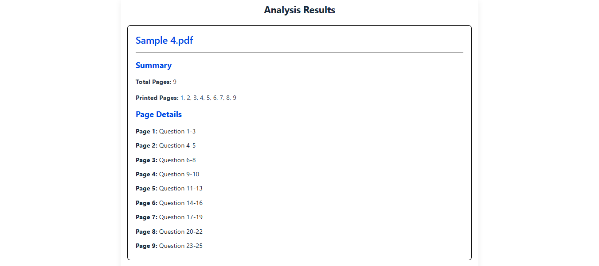

# 📄 QMap – PDF Question Mapper

QMap is a MERN-based web application that analyzes exam PDFs and generates a clean, structured summary of printed page numbers and question distributions.
It is designed to work **generically** on different PDF formats without hardcoding rules for a single document.

---

## 🚀 Features

- 📑 **Total PDF Pages Detection**
  Accurately counts the real number of pages in the uploaded PDF.

- 🔢 **Printed Page Number Extraction**
  Detects original printed page numbers from headers or footers, including:

  - Top / Bottom
  - Top Left / Top Right
  - Bottom Left / Bottom Right
    Supports formats like:
  - `1`
  - `Page 1`
  - `(5)`
  - `Page 10 of 90`
  - `- 7 -`

- ❓ **Question Mapping**
  Identifies where questions start in the document using patterns like:

  - `Q1`, `Q.1`
  - `Q (1)`
  - `Question 1`

- 📊 **Per-Page Summary**

  - Shows question **start–end range** per printed page
  - Clearly marks pages with **no questions**
  - Handles empty pages gracefully

- 🧠 **Generic & Robust Logic**

  - Works on hidden and unseen PDFs
  - Handles missing printed pages
  - Does not rely on hardcoded positions or formats

---

## 🏗️ Tech Stack

### Frontend

- React (Vite)
- Tailwind CSS
- Axios

### Backend

- Node.js
- Express.js
- pdfjs-dist (PDF.js)
- Multer (file uploads)

---

## 🔄 How It Works

### 1️⃣ Upload PDF

User uploads one or multiple exam PDFs from the frontend.

### 2️⃣ Backend Analysis

For each PDF:

- Reads total number of pages
- Extracts text with **x/y coordinates**
- Detects printed page numbers from header/footer regions
- Detects question starts using regex patterns
- Builds a structured summary per page

### 3️⃣ JSON Response

Backend returns structured metadata including:

- Total pages
- Printed page sequence
- Page-wise question summary

### 4️⃣ Frontend Display

Frontend displays:

- Overall summary
- Printed page sequence
- Page-by-page question details

---

## 📦 Sample Output (Simplified)

```json
{
  "fileName": "exam.pdf",
  "totalPages": 10,
  "printedPageSequence": [1, 2, 4, 5, 6],
  "pageSummary": [
    { "printedPage": 1, "summaryLabel": "No questions on this page" },
    { "printedPage": 2, "summaryLabel": "Question 1-5" },
    { "printedPage": 4, "summaryLabel": "Question 6-10" }
  ]
}
```

---

## 🌍 Source Code

💻 **GitHub Repo:** [https://github.com/FaiqaN27/QMap](https://github.com/FaiqaN27/QMap)

---

## 🖼 Screenshots / Demo





---

## ⚠️ Constraints Handled

- ✔ PDFs with missing printed pages
- ✔ Printed page numbers in any corner
- ✔ Empty pages
- ✔ Pages with headers/footers only
- ✔ Different question numbering styles
- ✔ Generic solution (no hardcoding)

---

## 🛠️ Setup Instructions

### Backend

```bash
cd api
npm install
npm run dev
```

### Frontend

```bash
cd frontend
npm install
npm run dev
```

Make sure to set the backend URL in your frontend `.env` file.

---

## 🎯 Use Case

QMap is ideal for:

- Exam paper analysis
- Academic content review
- Automated document indexing
- Assessment and evaluation tools

---

## 👩‍💻 Author

**QMap**
Built as part of a MERN assessment focusing on **PDF parsing and analysis**.

---
